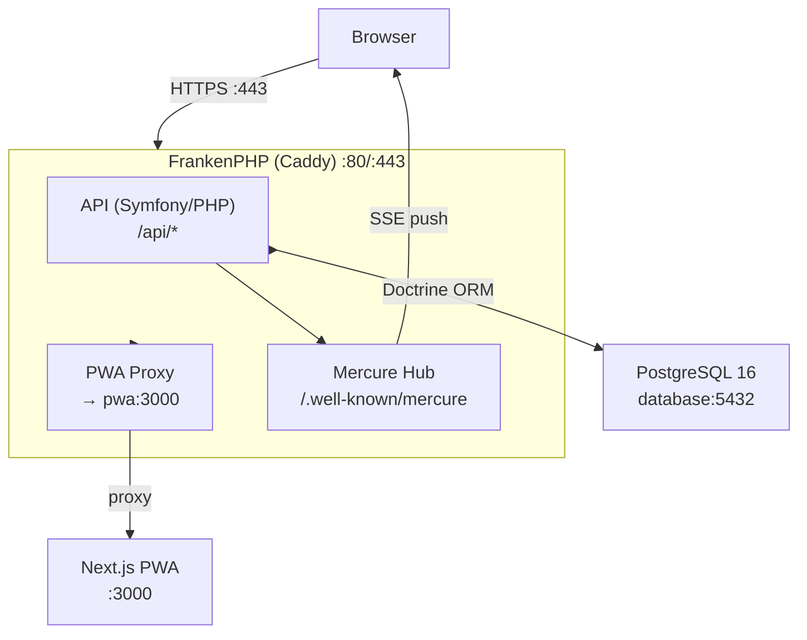

# Architecture

## System Overview

Aura follows an API-first architecture built on API Platform. The system consists of three runtime components orchestrated via Docker Compose.

## Component Details

### API (Symfony + API Platform)
- **Entry point**: FrankenPHP worker mode (no php-fpm, no nginx)
- **Routing**: API Platform auto-generates REST endpoints from entity attributes
- **Serialization**: Symfony Serializer with JSON-LD, JSON:API, HAL, etc.
- **Authentication**: Symfony Security Bundle (configurable)
- **Validation**: Symfony Validator constraints on entities
- **Database**: Doctrine ORM with PostgreSQL; migrations in `api/migrations/`

### PWA (Next.js)
- **Rendering**: Server-side rendering via Next.js
- **Admin panel**: Auto-generated admin UI at `/admin` via `@api-platform/admin`
- **API communication**: Hydra/JSON-LD client via API Platform's client libraries
- **Styling**: Tailwind CSS v4 with PostCSS

### Mercure
- **Purpose**: Real-time push notifications (server-sent events)
- **Integration**: Built into FrankenPHP/Caddy via Mercure hub
- **Usage**: Entities with `mercure: true` attribute auto-publish updates

## Data Flow

1. **Client request** hits FrankenPHP (Caddy) on port 443
2. Caddy routes to either the PHP API or proxies to the PWA (port 3000)
3. API Platform handles request lifecycle: deserialization, validation, persistence, serialization
4. Doctrine ORM manages database operations against PostgreSQL
5. On entity changes, Mercure publishes updates to subscribed clients

## Docker Services

| Service    | Image              | Purpose                    | Port  |
|------------|--------------------|-----------------------------|-------|
| php        | app-php            | API + FrankenPHP + Mercure  | 80/443|
| pwa        | app-pwa            | Next.js frontend            | 3000  |
| database   | postgres:16-alpine | PostgreSQL database         | 5432  |
